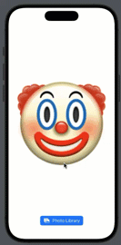

# BipTheGuy

BipTheGuy is a fun SwiftUI application where users can animate an image and play a sound effect when they tap on the image. Additionally, users can select a new image from their photo library to replace the default image.

## Features

- **Tap Animation**: Tap the image to see a quick animation and play a sound effect.
- **Photo Picker**: Select a new image from the photo library to replace the default image.

## Screenshots



## Requirements

- iOS 15.0+
- Xcode 13.0+
- SwiftUI

## Installation

1. Clone the repository:
   ```bash
   git clone https://github.com/dobson980/BipTheGuy.git
   ```

2. Open the project in Xcode:
   ```bash
   cd BipTheGuy
   open BipTheGuy.xcodeproj
   ```

##Usage

###Main View
The ContentView is the main view of the app where users can interact with the image and choose a new image from the photo library.

##Code Overview

###BipTheGuyApp
BipTheGuyApp is the entry point of the app.

```Swift
import SwiftUI

@main
struct BipTheGuyApp: App {
    var body: some Scene {
        WindowGroup {
            ContentView()
        }
    }
}
```

###ContentView
ContentView sets up the main view with an animated image that plays a sound on tap and a photo picker button.
```Swift
import SwiftUI
import AVFAudio
import PhotosUI

struct ContentView: View {
    @State private var audioPlayer: AVAudioPlayer?
    @State private var animateImage = true
    @State private var selectedPhoto: PhotosPickerItem?
    @State private var bipImage = Image("clown")
    
    var body: some View {
        VStack {
            Spacer()
            
            bipImage
                .resizable()
                .scaledToFit()
                .scaleEffect(animateImage ? 1.0 : 0.9)
                .onTapGesture {
                    playSound(soundName: "punch")
                    animateImage = false
                    withAnimation(.spring(response: 0.3, dampingFraction: 0.3)) {
                        animateImage = true
                    }
                }
            
            Spacer()
            
            PhotosPicker(selection: $selectedPhoto, matching: .images) {
                Label("Photo Library", systemImage: "photo.fill.on.rectangle.fill")
            }
            .buttonStyle(.borderedProminent)
            .onChange(of: selectedPhoto) {
                Task {
                    if let newImage = try? await selectedPhoto?.loadTransferable(type: Image.self) {
                        bipImage = newImage
                    } else {
                        print("Failed to set new image")
                    }
                }
            }

        }
        .padding()
    }
    
    func playSound(soundName: String) {
        guard let soundFile = NSDataAsset(name: soundName) else {
            print("Could not read file named: \(soundName)")
            return
        }
        do {
            audioPlayer = try AVAudioPlayer(data: soundFile.data)
            audioPlayer?.prepareToPlay()
            audioPlayer?.play()
        } catch {
            print("Error: \(error.localizedDescription) creating audioPlayer")
        }
    }
}

#Preview {
    ContentView()
}
```

##License
This project is licensed under the MIT License. See the [LICENSE](LICENSE) file for details.

